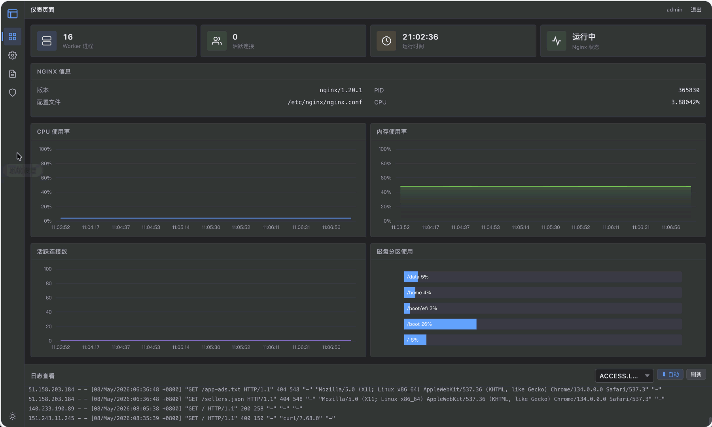
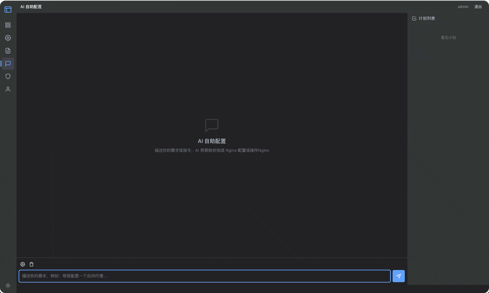

<p align="center">
  <b>中文</b> | <a href="./README.md">English</a>
</p>

<p align="center">
  
  
  <br/>
  
  
  
  <br/>
  
  
  
  
  
</p>

<h1 align="center">Nginx GUI 2</h1>

<p align="center">
  <b>真正的 Nginx 配置管理器 —— 不是又一个配置生成器</b>
</p>

<p align="center">
  深度解析 Nginx 配置语法，UI / Code 双模式自由切换。<br/>
  解析、修改、管理任意符合 Nginx 语法的配置，不破坏原始内容。
</p>

<p align="center">
  <a href="https://github.com/onlyGuo/nginx-gui-2/stargazers"></a>
  &nbsp;
  <a href="https://github.com/onlyGuo/nginx-gui-2/network/members"></a>
  &nbsp;
  <a href="https://github.com/onlyGuo/nginx-gui-2/watchers"></a>
</p>

---

<p align="center">
  
  
</p>

## 为什么选择 Nginx GUI 2？

传统的 Nginx GUI 工具本质上是**配置生成器** —— 你填表，它生成配置文件。但如果你已经有一套复杂的 Nginx 配置呢？它们无法解析，无法修改，只能让你从头来过。

**Nginx GUI 2 截然不同。** 它是一个真正理解 Nginx 语法的**配置管理器**：

| | 传统 GUI 工具 | Nginx GUI 2 |
|---|---|---|
| 从零生成配置 | 支持 | 支持 |
| **解析已有配置文件** | 不支持 | **支持** |
| **编辑已有配置且不丢失内容** | 不支持 | **支持** |
| **UI 模式 <-> Code 模式自由切换** | 不支持 | **支持** |
| **保留注释、格式、自定义指令** | 不支持 | **支持** |
| 管理任意合法 Nginx 配置 | 不支持 | **支持** |

**简单来说：** 如果你有一个 500 行的 `nginx.conf`，里面包含自定义注释、特殊指令和复杂嵌套 —— Nginx GUI 2 可以加载它、可视化展示它、让你在 UI 或代码编辑器中修改它，然后保存回去，**不会破坏任何原始内容**。

> 它不是配置生成器，而是一个**深度兼容的可视化 Nginx 编辑器**，让你绝对自由地掌控 Nginx。

---

## 功能特性

| 功能 | 说明 |
|------|------|
| **仪表盘** | 实时系统监控（CPU、内存、磁盘、连接数），Nginx 状态，SSE 流式推送访问/错误日志，历史趋势图表 |
| **Nginx 配置管理** | 深度解析 `conf.d/*.conf` 文件。结构化编辑（Server、Upstream、Location、SSL、代理）+ Monaco Editor 原始文本编辑（带语法高亮） |
| **全局配置** | 结构化编辑 main/events/http 级别指令（worker_processes、keepalive、gzip、SSL、log_format 等） |
| **双模式编辑（UI / Code）** | 随时在可视化 UI 模式和原始代码模式之间自由切换，修改双向同步 |
| **防火墙管理** | 自动检测防火墙工具（firewalld、iptables、nftables、ufw、pfctl），开关防火墙、增删端口规则 |
| **文件浏览器** | 浏览本地或远程文件系统，用于选择 SSL 证书、网站根目录等 |
| **双模式运行** | `local` 模式在容器内运行 Nginx；`remote` 模式通过 SSH 管理远程主机上的 Nginx |
| **配置校验** | 自动语法校验，失败时自动回滚 |
| **兼容已有配置** | 直接使用你现有的 `nginx.conf`，无需迁移，无需重写 |

---

## 技术栈

<table>
  <tr>
    <th>层级</th>
    <th>技术</th>
  </tr>
  <tr>
    <td></td>
    <td>Java 17, Spring Boot 4.0, H2 数据库, JSch (SSH)</td>
  </tr>
  <tr>
    <td></td>
    <td>Vue 3, Pinia, Vite, Monaco Editor, ECharts</td>
  </tr>
  <tr>
    <td></td>
    <td>Docker（多平台 amd64/arm64）, docker-compose</td>
  </tr>
</table>

---

## 快速开始

### 1. 拉取镜像直接运行（推荐）

```bash
# 本地 Nginx + 宿主机监控（Host 网络模式）
docker run -d --network host \
  -v nginx-gui-data:/app/data \
  -e NGINX_MODE=local \
  -e SSH_HOST=localhost \
  -e SSH_USERNAME=<宿主机用户名> \
  -e SSH_PASSWORD=<宿主机密码> \
  --name nginx-gui guoshengkai/nginx-gui-2:latest

# 远程 Nginx 模式
docker run -d -p 8080:80 \
  -v nginx-gui-data:/app/data \
  -e NGINX_MODE=remote \
  -e SSH_HOST=<远程主机IP> \
  -e SSH_USERNAME=<用户名> \
  -e SSH_PASSWORD=<密码> \
  --name nginx-gui guoshengkai/nginx-gui-2:latest
```

访问 **http://localhost:8080**（默认账号：`admin` / `admin`）

### 2. Docker Compose

```bash
git clone https://github.com/onlyGuo/nginx-gui-2.git
cd nginx-gui-2
docker compose up -d
```

### 3. 自行构建镜像

```bash
git clone https://github.com/onlyGuo/nginx-gui-2.git
cd nginx-gui-2

# 构建镜像
docker build -t nginx-gui-2 .

# 运行
docker run -d --network host \
  -v nginx-gui-data:/app/data \
  -e NGINX_MODE=local \
  -e SSH_HOST=localhost \
  -e SSH_USERNAME=<宿主机用户名> \
  -e SSH_PASSWORD=<宿主机密码> \
  --name nginx-gui nginx-gui-2

# 多平台构建（需要 buildx）
docker buildx build --platform linux/amd64,linux/arm64 -t nginx-gui-2 .
```

---

## 环境变量

| 变量 | 默认值 | 说明 |
|------|--------|------|
| `NGINX_MODE` | `local` | `local` = 容器内 Nginx，`remote` = 通过 SSH 管理远程 Nginx |
| `SSH_HOST` | （空） | 远程 Nginx 的 SSH 地址（`NGINX_MODE=remote` 时使用） |
| `SSH_PORT` | `22` | 远程 Nginx SSH 端口 |
| `SSH_USERNAME` | `root` | 远程 Nginx SSH 用户名 |
| `SSH_PASSWORD` | （空） | 远程 Nginx SSH 密码 |
| `SSH_SYSTEM_HOST` | （空） | 宿主机系统信息的 SSH 地址（仪表盘使用） |
| `SSH_SYSTEM_PORT` | `22` | 宿主机 SSH 端口 |
| `SSH_SYSTEM_USERNAME` | `root` | 宿主机 SSH 用户名 |
| `SSH_SYSTEM_PASSWORD` | （空） | 宿主机 SSH 密码 |

---

## 运行模式

<p align="center">
  <b>本地模式</b> &nbsp;&nbsp;&nbsp; | &nbsp;&nbsp;&nbsp; <b>远程模式</b>
</p>

- **本地模式**（`NGINX_MODE=local`）：Nginx 在容器内运行于 80 端口，提供 Vue SPA 静态文件服务并将 `/api/` 代理到 Spring Boot。应用通过本地 CLI 管理容器内的 Nginx。
- **远程模式**（`NGINX_MODE=remote`）：容器内不运行 Nginx。应用通过 SSH 连接远程服务器管理 Nginx。
- 两种模式均支持 `SSH_SYSTEM_*` 环境变量，仪表盘通过 SSH 连接宿主机采集系统指标（CPU、内存、磁盘）。

---

## 项目结构

```
nginx-gui-2/
├── src/main/java/ink/icoding/nginx/
│   ├── config/          # SSH、路径、自动配置
│   ├── core/            # NginxClient -- Nginx 核心解析器与操作
│   ├── utils/           # CommandUtil、FileUtil（本地/SSH 抽象）
│   └── web/             # REST 控制器（仪表盘、配置、防火墙、文件）
├── webui/               # Vue 3 SPA 前端
│   └── src/
│       ├── views/       # Dashboard、NginxConfig、BasicConfig、Firewall、Login
│       └── components/  # MonacoEditor、LogPanel、Layout
├── docker/              # nginx.conf、entrypoint.sh
├── Dockerfile           # 多阶段构建（Node -> Maven -> Runtime）
└── docker-compose.yml
```

---

## 参与贡献

欢迎参与贡献！随时提交 Issue 和 Pull Request。

1. Fork 本仓库
2. 创建功能分支（`git checkout -b feature/amazing-feature`）
3. 提交更改（`git commit -m '添加某个功能'`）
4. 推送到分支（`git push origin feature/amazing-feature`）
5. 提交 Pull Request

---

## 开源协议

[](./LICENSE)

---

<p align="center">
  如果这个项目对你有帮助，请给它一个 <a href="https://github.com/onlyGuo/nginx-gui-2/stargazers">Star</a> 吧！
</p>
